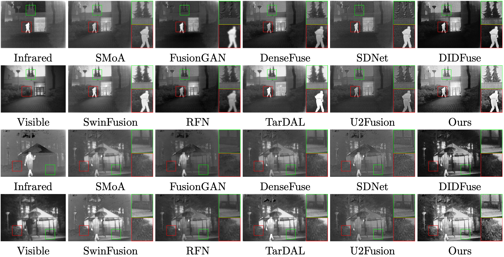

<div align="center">
  <h1 align="center">CoCoNet: Coupled Contrastive Learning Network with Multi-level Feature Ensemble for Multi-modality Image Fusion</h1>

  <p align="center">
    <a href="https://github.com/JinyuanLiu-CV">Jinyuan Liu</a><sup>1</sup>,
	<a href=https://github.com/runjia0124/ target=_blank rel=noopener>Runjia Lin</a><sup>1</sup>, 
    Guanyao Wu<sup>1</sup>, 
    <a href=https://rsliu.tech/ target=_blank rel=noopener>Risheng Liu</a><sup>1,2</sup>,
    Zhongxuan Luo<sup>1</sup> and 
    Xin Fan<sup>1</sup>
    </sup>
      <br>
      <sup>1</sup>Dalian University of Technology
      <sup>2</sup>Peng Cheng Laboratory
    <br />
    <a href="https://arxiv.org/abs/2203.03949">Arxiv</a> 

  </p>
</div>

## Introduction

we propose a coupled contrastive learning network, dubbed CoCoNet, to realize infrared and visible image fusion in an end-to-end manner. Concretely, to simultaneously retain typical features from both modalities and remove unwanted information emerging on the fused result, we develop a coupled contrastive constraint in our loss this http URL a fused imge, its foreground target/background detail part is pulled close to the infrared/visible source and pushed far away from the visible/infrared source in the representation space. We further exploit image characteristics to provide data-sensitive weights, which allows our loss function to build a more reliable relationship with source images. Furthermore, to learn rich hierarchical feature representation and comprehensively transfer features in the fusion process, a multi-level attention module is established. In addition, we also apply the proposed CoCoNet on medical image fusion of different types, e.g., magnetic resonance image and positron emission tomography image, magnetic resonance image and single photon emission computed tomography image. Extensive experiments demonstrate that our method achieves the state-of-the-art (SOTA) performance under both subjective and objective evaluation, especially in preserving prominent targets and recovering vital textural details.


## Installation

Clone repo:
```
git clone https://github.com/runjia0124/CoCoNet.git
cd CoCoNet
```

The code is tested with Python == 3.7, PyTorch == 1.10.1 and CUDA == 11.3 on NVIDIA GeForce RTX 3090. We recommend you to use [anaconda](https://www.anaconda.com/) to manage dependencies. You may need to change the torch and cuda version in the `requirements.txt` according to your computer.
```
conda create -n rcmvsnet python=3.7
conda install pytorch==1.10.1 torchvision==0.11.2 torchaudio==0.10.1 cudatoolkit=11.3 -c pytorch -c conda-forge
conda activate rcmvsnet
pip install -r requirements.txt
```

## Results


## Testing
`python main.py --test --use_gpu`

## Training
Coming soon...


## Contact

If you have any questions, please raise an issue or email to Runjia Lin (`linrunja@gmail.com`) or Jinyuan Liu (` atlantis918@hotmail.com`).

## Acknowledgments

Template is adapted from this awesome repository. Appreciate!

* [RC-MVSNet](https://github.com/Boese0601/RC-MVSNet)
